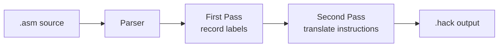

# HackAssembler

This repository contains a Hack assembler written in Python for nand2tetris
Project 6.

The assembler translates symbolic Hack assembly language into Hack binary
machine code.

## Course Context

This repository corresponds to:

- Project 6: The Assembler

Official project page:

- [Project 6](https://www.nand2tetris.org/project06)

In the nand2tetris toolchain, the assembler is the first software translation
layer. It converts human-readable Hack assembly programs into the 16-bit binary
instructions that run on the Hack hardware platform.

## What This Repository Does

This assembler accepts one Hack assembly source file:

- input: `Prog.asm`

It produces one machine-code file:

- output: `Prog.hack`

The output is written next to the input file. Each line in the generated
`.hack` file is a 16-bit binary instruction.

The implementation supports:

- A-instructions
- C-instructions
- label declarations
- predefined symbols
- label resolution
- variable allocation

The assembler follows the standard two-pass strategy described in the course:

1. first pass: collect label definitions
2. second pass: translate instructions and resolve symbols

## Repository Layout

```text
.
├── Assembler/
│   ├── HackAssembler.py
│   ├── Parser.py
│   ├── SymbolTable.py
│   ├── Translator.py
│   ├── Cmd.py
│   └── CmdVisitor.py
└── AssemblerPrograms/
```

### Main Files

- `Assembler/HackAssembler.py`
  Main CLI entrypoint and orchestration of the two-pass assembly process.
- `Assembler/Parser.py`
  Reads assembly source, strips comments and whitespace, and parses commands.
- `Assembler/SymbolTable.py`
  Stores predefined symbols and dynamically discovered labels and variables.
- `Assembler/Translator.py`
  Converts parsed A- and C-instructions into binary strings.
- `Assembler/Cmd.py`
  Command model for A-instructions, C-instructions, and labels.
- `Assembler/CmdVisitor.py`
  Visitor interface used by the translator.

### Bundled Assembly Programs

The `AssemblerPrograms/` folder contains the sample Project 6 assembly programs:

- `Add.asm`
- `Max.asm`
- `MaxL.asm`
- `Rect.asm`
- `RectL.asm`
- `Pong.asm`
- `PongL.asm`

These are the same kinds of programs used in the official nand2tetris Project 6
workflow.

## How To Run

This project uses only the Python standard library. No external dependencies
are required.

Run commands from the repository root with `python3`.

### Assemble a Single File

```bash
python3 Assembler/HackAssembler.py path/to/Prog.asm
```

This generates:

```text
path/to/Prog.hack
```

### Output Naming

The assembler writes the output file next to the input file:

- `Add.asm -> Add.hack`
- `Pong.asm -> Pong.hack`

### Examples Using This Repository

```bash
python3 Assembler/HackAssembler.py AssemblerPrograms/Add.asm
python3 Assembler/HackAssembler.py AssemblerPrograms/Max.asm
python3 Assembler/HackAssembler.py AssemblerPrograms/Rect.asm
python3 Assembler/HackAssembler.py AssemblerPrograms/Pong.asm
```

## Architecture

The assembler is implemented as a two-pass translator. The parser reads and
classifies commands, the symbol table stores known symbols, and the translator
turns parsed commands into binary.



### 1. Two-Pass Assembly

The main flow in `Assembler/HackAssembler.py` is:

1. parse the source file once and record all label definitions
2. reset the parser
3. parse the file again
4. translate each A- or C-instruction into binary
5. write each translated instruction to the output `.hack` file

This matches the staged design recommended in Project 6.

### 2. Parser

`Assembler/Parser.py` is responsible for:

- reading assembly source line by line
- stripping comments
- stripping whitespace
- skipping empty lines
- distinguishing between:
  - A-instructions
  - C-instructions
  - label commands

It also exposes helpers for parsing:

- label symbols
- A-instruction addresses
- C-instruction `dest`
- C-instruction `comp`
- C-instruction `jump`

### 3. Symbol Table

`Assembler/SymbolTable.py` seeds the assembler with the predefined Hack symbols:

- `R0` through `R15`
- `SP`
- `LCL`
- `ARG`
- `THIS`
- `THAT`
- `SCREEN`
- `KBD`

During assembly:

- label symbols are added in the first pass with their ROM addresses
- variable symbols are allocated in the second pass starting at RAM address `16`

### 4. Translator

`Assembler/Translator.py` performs the binary translation.

It contains lookup tables for:

- `comp`
- `dest`
- `jump`

It handles:

- numeric A-instructions like `@21`
- symbolic A-instructions like `@counter`
- C-instructions like `D=M`, `0;JMP`, or `D=D+M`

### 5. Command Model

The assembler uses a small command hierarchy:

- `AInstructionCmd`
- `CInstructionCmd`
- `LabelCmd`

Each command supports a `visit(...)` method, and the translator implements the
visitor interface in `CmdVisitor.py`.

That gives the code a clean separation between:

- parsing commands
- representing commands
- translating commands

## Supported Hack Assembly Constructs

### A-Instructions

Examples:

- `@2`
- `@R0`
- `@LOOP`
- `@counter`

These translate to binary instructions of the form:

```text
0vvvvvvvvvvvvvvv
```

### C-Instructions

Examples:

- `D=A`
- `M=D+1`
- `0;JMP`
- `D;JGT`
- `MD=D-1`

These translate to binary instructions of the form:

```text
111accccccdddjjj
```

### Labels

Example:

```text
(LOOP)
```

Labels do not produce output instructions directly. They define symbolic ROM
addresses used by later A-instructions.

## Symbol Handling

Project 6 is explicitly about symbolic translation, so symbol handling is a key
part of the implementation.

### Predefined Symbols

The assembler includes the standard predefined Hack symbols:

- `R0`..`R15`
- `SP`
- `LCL`
- `ARG`
- `THIS`
- `THAT`
- `SCREEN`
- `KBD`

### Label Symbols

Label declarations like `(LOOP)` are processed in the first pass.

They are mapped to ROM addresses, meaning the address of the next actual
instruction in the program.

### Variable Symbols

Unknown symbols that appear in A-instructions during the second pass are
treated as variables.

They are assigned RAM addresses starting at `16`.

## Running on the Bundled Assembly Programs

The `AssemblerPrograms/` directory contains the standard sample programs for
Project 6.

### `Add.asm`

Adds `2` and `3` and stores the result in `R0`.

This is the simplest first validation target.

### `Max.asm` and `MaxL.asm`

Computes `max(R0, R1)` and stores the result in `R2`.

- `Max.asm` uses symbols
- `MaxL.asm` is the symbol-free version

### `Rect.asm` and `RectL.asm`

Draws a rectangle at the top-left corner of the screen.

- `Rect.asm` uses symbols
- `RectL.asm` is the symbol-free version

### `Pong.asm` and `PongL.asm`

A full Pong game in Hack assembly.

- `Pong.asm` uses symbols
- `PongL.asm` is the symbol-free version

These larger programs are useful for validating both correctness and robustness
of symbol handling.

## Official Testing Workflow

The official Project 6 workflow uses the supplied nand2tetris assembler and CPU
Emulator for validation.

### Stage 1: Test Without Symbols

Start with programs that do not require symbol resolution:

- `Add.asm`
- `MaxL.asm`
- `RectL.asm`
- `PongL.asm`

This validates the basic A- and C-instruction translation logic.

### Stage 2: Test With Symbols

Then move to the symbolic versions:

- `Max.asm`
- `Rect.asm`
- `Pong.asm`

This validates:

- label resolution
- predefined symbols
- variable allocation

### Comparison-Based Validation

The Project 6 page recommends comparing your assembler output against the output
produced by the supplied nand2tetris assembler.

The usual flow is:

1. assemble `Prog.asm` with the supplied assembler to produce a reference
   `Prog.hack`
2. assemble the same file with this repository's assembler
3. compare the two generated `.hack` files

If the files are identical, the assembler is likely correct.

### CPU Emulator Validation

For programs like `Rect` and `Pong`, behavioral validation in the CPU Emulator
is also useful, since it shows that the generated machine code behaves
correctly on the Hack platform.

## Two-Stage Development Context

The official Project 6 page suggests building the assembler in two stages:

1. first implement assembly translation for programs with no symbols
2. then extend the assembler with symbol handling

This repository’s final implementation already includes both stages, but the
sample program layout still reflects that recommended progression.

The presence of both symbolic and symbol-free `L` variants makes it easy to
validate the assembler incrementally.

## Suggested Workflow

If you want to understand or modify the assembler, the most useful order is:

1. start with `Assembler/HackAssembler.py`
2. read `Assembler/Parser.py`
3. read `Assembler/Cmd.py` and `Assembler/CmdVisitor.py`
4. read `Assembler/SymbolTable.py`
5. finish with `Assembler/Translator.py`

If you want to validate changes incrementally:

1. start with `AssemblerPrograms/Add.asm`
2. move to `MaxL.asm`, `RectL.asm`, and `PongL.asm`
3. then validate full symbol handling on `Max.asm`, `Rect.asm`, and `Pong.asm`

## References

- [Project 6](https://www.nand2tetris.org/project06)
